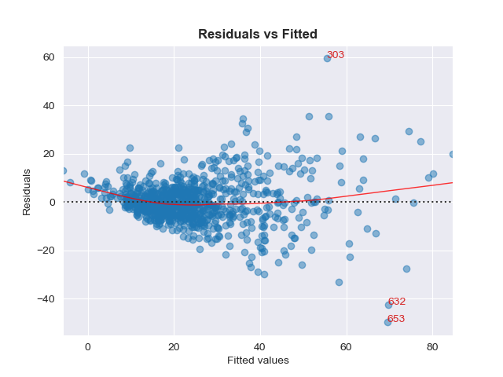
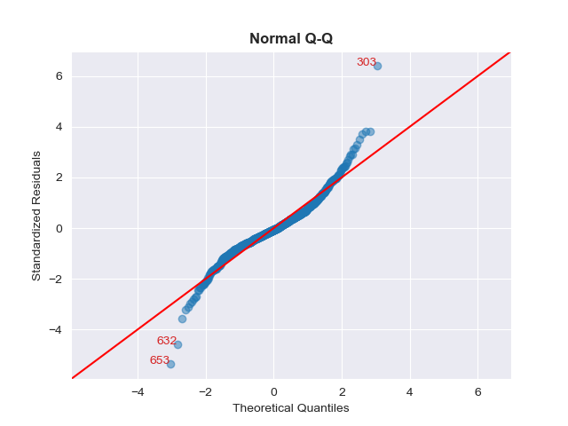
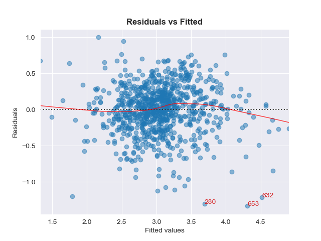
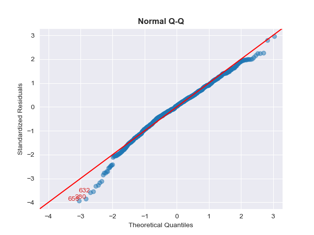

# Custom Multiple Linear Regression Algorithm

## Overview

This project implements a custom multiple linear regression algorithm from scratch and compares its performance with Scikit-Learn's `LinearRegression`. The goal is to calculate the model's coefficients using the normal equation, compare the custom implementation's performance with Scikit-Learn’s implementation, and explore methods to improve model performance, such as applying a logarithmic transformation to the target variable.

### Dataset Information
- **Number of instances**: 1213
- **Number of features**: 11

## Custom Multiple Linear Regression

This custom regression model estimates coefficients using the following formula:

**Yi = β₀ + β₁ Xi1 + β₂ Xi2 + ... + βₚ Xip + εi**

Where:
- **Yi** is the target variable for the i-th observation.
- **Xi1, Xi2, ..., Xip** are the input features for the i-th observation.
- **β₀, β₁, ..., βₚ** are the coefficients (calculated by the model).
- **εi** is the error term.

Coefficients are calculated using the **normal equation**:

**β̂ = (Xᵀ X)⁻¹ Xᵀ y**

Where:
- **X** is the matrix of input features with an added intercept column.
- **y** is the target vector.
- **β̂** represents the calculated coefficients.

### Steps to Train the Model

1. **Feature Matrix (X)**: The input features are represented by **X**, including an intercept column.
2. **Target Vector (y)**: The target variable **y** represents actual values to be predicted.
3. **Normal Equation**: Using the equation, the model computes regression coefficients by calculating the inverse of **Xᵀ X** and then multiplying it by **Xᵀ y**.
4. **Model Comparison**: The custom model’s performance is then compared with Scikit-Learn's `LinearRegression` on the same dataset.

### Model Performance

Both the custom multiple linear regression and Scikit-Learn’s `LinearRegression` produced identical metrics:

#### Custom Multiple Linear Regression Performance:
- **Mean Absolute Error (MAE)**: 6.536
- **Mean Squared Error (MSE)**: 86.436
- **R-squared (R²)**: 0.667

#### Scikit-Learn Linear Regression Performance:
- **Mean Absolute Error (MAE)**: 6.536
- **Mean Squared Error (MSE)**: 86.436
- **R-squared (R²)**: 0.667

### Residual Analysis

Residuals (the differences between predicted and actual values) for both models were analyzed to assess their distribution. The residuals are centered around zero, suggesting a good fit with no significant bias.

### Visualizing the Residuals

The plot below shows the residuals for both the custom multiple linear regression and Scikit-Learn’s linear regression. It can be observed that the residuals do not have constant variance, indicating potential heteroscedasticity in the model. To formally test this, we conducted a Breusch-Pagan test. Since the p-value was below 0.05, we rejected the null hypothesis, confirming that the model exhibits' heteroscedasticity.

### Normal Distribution of Residuals

To assess the normality of residuals, a Q-Q plot of the residuals was created. The plot shows that the residuals follow a roughly normal distribution.

### Improving the Model with Logarithmic Transformation

To improve model accuracy, a logarithmic transformation was applied to the target variable. This transformation yielded a slight improvement in model performance, with the following updated metrics:

#### Performance after Log Transformation:
- **Mean Absolute Error (MAE)**: 6.477
- **Mean Squared Error (MSE)**: 98.113
- **R-squared (R²)**: 0.622

### Residuals and Q-Q Plot After Log Transformation

The residuals plot and Q-Q plot below reflect the distribution of errors and demonstrate that the transformation resulted in residuals that are closer to a normal distribution, further enhancing the model's performance.

## Conclusion

This project successfully demonstrated a custom multiple linear regression implementation using the normal equation and evaluated its performance against Scikit-Learn's model. While both models initially performed similarly, a logarithmic transformation of the target variable improved the custom model's performance, achieving slightly better metrics and normality in residual distribution. 
