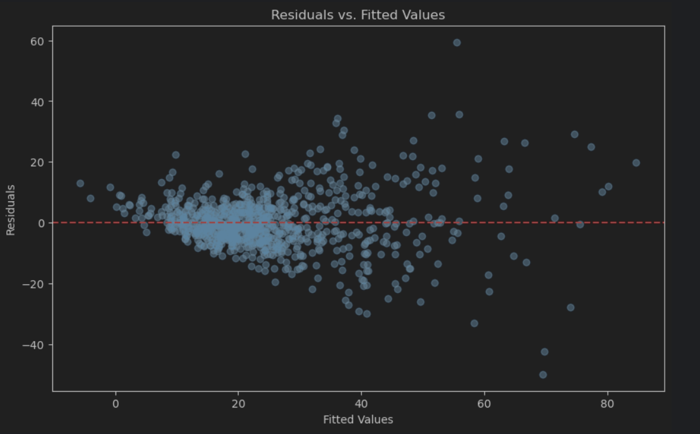

# Custom Multiple Linear Regression Algorithm

## Overview

This project implements a custom multiple linear regression algorithm from scratch and compares its performance with Scikit-Learn's built-in `LinearRegression` model. The goal is to calculate the model's coefficients using the normal equation, compare the custom implementation's performance against the Scikit-Learn implementation, and explore whether we can improve the performance of the model.

### Dataset Information:
- **Number of instances**: 1213
- **Number of features**: 11

### Custom Multiple Linear Regression

In this project, I implemented the following regression model manually:

**Yi = β₀ + β₁ Xi1 + β₂ Xi2 + ... + βₚ Xip + εi**

Where:
- **Yi** is the target variable for the i-th observation.
- **Xi1, Xi2, ..., Xip** are the input features for the i-th observation.
- **β₀, β₁, ..., βₚ** are the coefficients (calculated by the model).
- **εi** is the error term.

The coefficients are computed using the **normal equation**:

**β̂ = (Xᵀ X)⁻¹ Xᵀ y**

Where:
- **X** is the matrix of input features.
- **y** is the target vector.
- **β̂** are the model's calculated coefficients.

### Steps to Train the Model:

1. **Feature Matrix (X)**: 
   - The input features are represented by a matrix **X**, and an intercept term (a column of ones) is added to account for the constant term in the linear model.

2. **Target Vector (y)**:
   - The target variable **y** represents the actual values we aim to predict.

3. **Normal Equation**:
   - Using the normal equation, the model computes the regression coefficients by calculating the inverse of **Xᵀ X**, followed by multiplying it with **Xᵀ y**.

4. **Model Comparison**:
   - After implementing the custom linear regression, its performance was compared to Scikit-Learn's `LinearRegression` using the same dataset to see if we could match or improve upon the Scikit-Learn model's performance.

### Model Performance

Both the custom multiple linear regression and the Scikit-Learn model yielded identical performance metrics:

#### Custom Multiple Linear Regression Performance:
- **Mean Absolute Error (MAE)**: 6.536
- **Mean Squared Error (MSE)**: 86.436
- **R-squared (R²)**: 0.667

#### Scikit-Learn Linear Regression Performance:
- **Mean Absolute Error (MAE)**: 6.536
- **Mean Squared Error (MSE)**: 86.436
- **R-squared (R²)**: 0.667

### Residual Analysis

Residuals (the differences between predicted and actual values) for both models were plotted to assess their distribution. The residuals are centered around zero for both the custom model and the Scikit-Learn model, indicating that the models are well-fitted.

### Visualizing the Residuals

The plot below shows the residuals for both the custom multiple linear regression and Scikit-Learn's linear regression. You can observe that the residuals are spread around zero, indicating a good model fit without significant bias.

